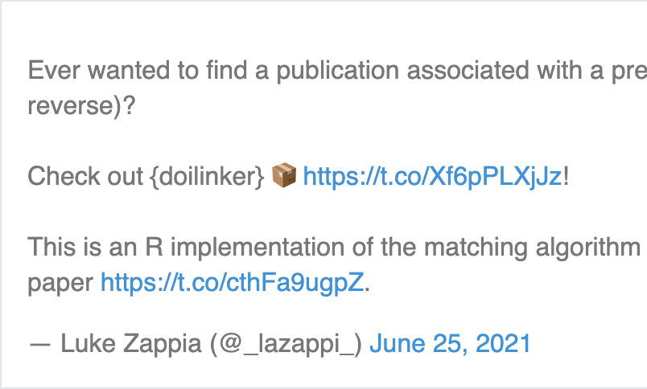
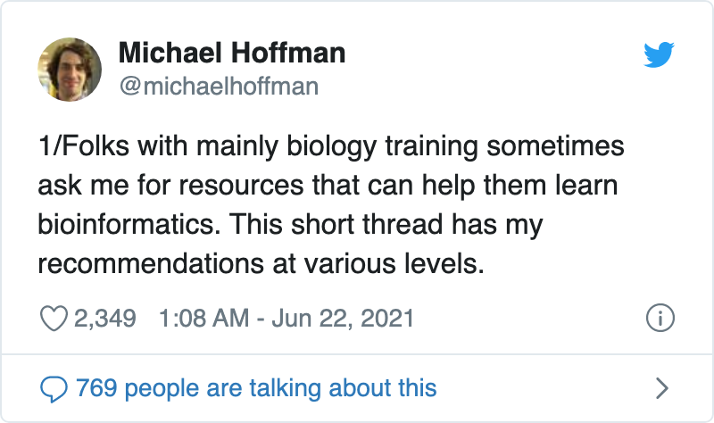

<!-- README.md is generated from README.Rmd. Please edit that file -->

### Hi, I’m Luke 👋

<!--
**lazappi/lazappi** is a ✨ _special_ ✨ repository because its `README.md` (this file) appears on your GitHub profile.

Here are some ideas to get you started:

- 🔭 I’m currently working on ...
- 🌱 I’m currently learning ...
- 👯 I’m looking to collaborate on ...
- 🤔 I’m looking for help with ...
- 💬 Ask me about ...
- 📫 How to reach me: ...
- 😄 Pronouns: ...
- ⚡ Fun fact: ...
-->

### Here’s some stats on my GitHub repos

*Courtesy of <https://github.com/anuraghazra/github-readme-stats>*

### Some recent blog posts

  - [triple j’s
    Requestival](https://lazappi.id.au/post/2020-07-11-requestival/)
  - [Back to the
    SCE-verse\!](https://lazappi.id.au/post/2020-05-12-back-to-the-sce-verse/)
  - [Bioconductor 3.11
    wrap-up](https://lazappi.id.au/post/2020-04-29-bioconductor-3-11-wrap-up/)

*More at <https://lazappi.id.au>*

### My latest tweet 👇 and retweet 👉

 

